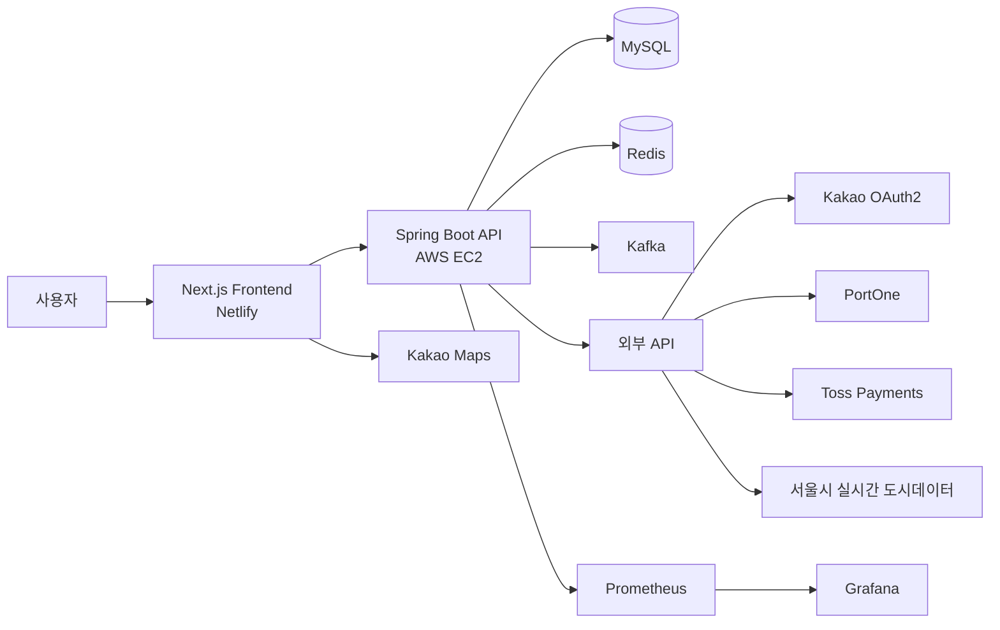

# Re:Seat

> 경기 조회부터 대기열, 좌석 선점, 주문/결제, 티켓 발급, 환불로 이어지는 KBO 경기 예매 서비스

Re:Seat는 인기 경기의 동시 예매 요청을 안정적으로 처리하고, 사용자가 경기 선택부터 티켓 관리까지 하나의 흐름으로 이용할 수 있도록 만든 야구 예매 서비스입니다.

Redis와 Kafka를 활용한 경기별 대기열, 좌석 선점, 주문·결제, 티켓 발급 및 티켓 단위 환불 기능을 제공합니다. 서울시 실시간 도시데이터와 카카오맵을 연동하여 경기장 주변 혼잡도도 확인할 수 있습니다.

- 서비스: [https://re-seat.netlify.app](https://re-seat.netlify.app/)

---

## 팀원 소개

<table>
  <thead>
    <tr>
      <th width="13%">파트</th>
      <th width="20%">담당 도메인</th>
      <th>주요 역할</th>
      <th width="10%" align="center">담당자</th>
    </tr>
  </thead>
  <tbody>
    <tr>
      <td>사용자·인프라</td>
      <td><code>user</code>, <code>verification</code>, <code>citydata</code>, 배포·모니터링</td>
      <td>인증·인가, 회원 관리, 배포·운영 환경, 외부 API(날씨·지도) 연동, 모니터링</td>
      <td align="center">
        <a href="https://github.com/LFCKJ">
          
          <br/>
          <sub><b>김재환(팀원)</b></sub>
        </a>
      </td>
    </tr>
    <tr>
      <td>대기열·주문</td>
      <td><code>queue</code>, <code>order</code></td>
      <td>진입 게이트, 대기열, SSE, 입장 토큰, CAPTCHA, 주문 상태·만료</td>
      <td align="center">
        <a href="https://github.com/bepo03">
          
          <br/>
          <sub><b>전윤현(팀장)</b></sub>
        </a>
      </td>
    </tr>
    <tr>
      <td>경기·좌석·예약</td>
      <td><code>game</code>, <code>stadium</code>, <code>seatinventory</code>, <code>reservation</code></td>
      <td>경기·좌석 조회, 좌석 HOLD·해제·만료, 동시성 제어와 락 전략 비교, <br/>소유 도메인 관리자 API, 고객 안내 챗봇</td>
      <td align="center">
        <a href="https://github.com/r1nn-dev">
          
          <br/>
          <sub><b>조하린(팀원)</b></sub>
        </a>
      </td>
    </tr>
    <tr>
      <td>결제</td>
      <td><code>payment</code></td>
      <td>Toss Payments, 멱등 승인, 부분·전체 환불, 취소 이력 관리, PG 복구, 결제 이력</td>
      <td align="center">
        <a href="https://github.com/Siho-ily">
          
          <br/>
          <sub><b>박현수(팀원)</b></sub>
        </a>
      </td>
    </tr>
    <tr>
      <td>티켓</td>
      <td><code>ticket</code></td>
      <td>티켓 발급·상태 관리, QR 검표, 마이페이지 통합 조회, 관리자 조회·강제 취소</td>
      <td align="center">
        <a href="https://github.com/rmi9394">
          
          <br/>
          <sub><b>유명인(팀원)</b></sub>
        </a>
      </td>
    </tr>
  </tbody>
</table>

---

## 주요 기능

> 도메인별 담당 및 구현 기능

### 사용자 인증 (`user`)

- 카카오 OAuth2 소셜 로그인을 지원합니다.
- JWT를 이용해 사용자 인증과 API 접근 권한을 관리합니다.
- PortOne 본인인증을 통해 예매 사용자를 확인합니다.
- 일반 사용자와 관리자 권한을 구분합니다.

### 경기·좌석 (`game`, `seatinventory`)

- 예매 가능한 경기 목록과 경기 상세 정보, 날짜별 예매 가능 상태를 조회합니다.

### 대기열 (`queue`)

- 경기별 대기열을 통해 동시 예매 요청을 순차적으로 처리합니다.
- Kafka를 이용해 대기열 진입 요청을 비동기로 처리합니다.
- Redis ZSet을 이용해 경기별 대기 순서를 관리합니다.
- SSE를 통해 대기 순서와 입장 상태를 실시간으로 전달합니다.
- 입장이 허용된 사용자에게 제한 시간이 있는 Queue-Token을 발급합니다.

### 좌석 선택과 예매 (`reservation`)

- 경기별 좌석 등급, 가격과 예매 가능 상태를 조회합니다.
- Redis와 Redisson을 이용 좌석 선점과 동시 요청을 제어합니다.
- 제한 시간 동안 선택한 좌석을 임시 선점합니다.
- 좌석 선점 결과를 예약과 주문으로 연결합니다.

### 주문과 결제 (`order`, `payment`)

- 선점한 좌석을 기준으로 주문을 생성합니다.
- 주문별 결제 기한을 관리하고 만료된 주문을 자동으로 처리합니다.
- Toss Payments를 연동해 결제 승인과 취소를 처리합니다.
- 결제 결과에 따라 주문, 예약, 좌석과 티켓 상태를 함께 변경합니다.
- 실패한 결제 처리를 복구할 수 있도록 복구 작업을 관리합니다.

### 티켓과 환불 (`ticket`)

- 결제가 완료된 주문에 대해 QR 토큰이 포함된 티켓을 발급합니다.
- 사용자가 보유한 티켓 목록과 상세 정보를 조회합니다.
- 티켓의 환불 가능 여부와 환불 기한을 제공합니다.
- 주문에 포함된 티켓을 한 장 단위로 취소·환불할 수 있습니다.
- 환불 진행, 실패, 완료 상태를 구분하고 실패한 환불을 재시도할 수 있습니다.

### 구장 혼잡도 (`citydata`)

- 서울시 실시간 도시데이터를 이용해 경기장 주변 혼잡도를 제공합니다.
- 카카오맵에서 구장 위치와 구역별 혼잡도를 확인할 수 있습니다.

---

## 기술 스택

| 구분 | 기술 |
| --- | --- |
| Backend | Java 17, Spring Boot 3.5.16, Spring Security, OAuth2, Spring Data JPA, QueryDSL |
| Frontend | TypeScript, Next.js 16, React 19, Tailwind CSS 4, TanStack Query, Zustand |
| Database | MySQL 8.0, Flyway |
| Cache·Lock | Redis 7.4, Redisson |
| Messaging | Apache Kafka 3.9.2 |
| 결제·인증 연동 | Toss Payments, Kakao OAuth2, PortOne |
| 외부 데이터 연동 | 서울시 실시간 도시데이터 API, Kakao Maps |
| API 문서 | springdoc-openapi(Swagger UI) |
| Monitoring | Spring Boot Actuator, Prometheus, Grafana |
| Test | JUnit 5, Testcontainers(MySQL) |
| Frontend Test | Vitest, Testing Library, MSW |
| Load Test | k6 |
| Code Quality | Checkstyle(Naver Convention), Spotless |
| Infra·Deploy | Docker, Docker Compose, GitHub Actions, Docker Hub, AWS EC2, Netlify |

---

## 서비스 구조



---

## 예매 흐름

```mermaid
flowchart LR
    Game[경기 선택] --> OneEntryGate[1차 진입 게이트]
    OneEntryGate --> Queue[대기열 진입]
    Queue --> Token[Queue-Token 발급]
    Token --> Captcha[CAPTCHA 검증]
    Captcha --> Seat[좌석 선택/선점]
    Seat --> Reservation[예약 생성]
    Reservation --> Order[주문 생성]
    Order --> Payment[결제]
    Payment --> Ticket[티켓 발급]
    Ticket --> Refund[티켓 단위 환불]
```



---

## 프로젝트 구조

```text
re-seat
├── src
│   ├── main
│   │   ├── java/com/backtoback/reseat
│   │   │   ├── domain
│   │   │   │   ├── admin
│   │   │   │   │   └── game        # 경기 예매 상태 관리자 API
│   │   │   │   ├── citydata        # 서울시 실시간 도시데이터 연동, 구장 혼잡도
│   │   │   │   ├── game
│   │   │   │   ├── order
│   │   │   │   ├── payment         # Toss 연동, PG 상태 기반 복구
│   │   │   │   ├── queue           # Kafka·Redis 대기열, SSE
│   │   │   │   ├── reservation     # 좌석 HOLD, Redisson 분산 락
│   │   │   │   ├── seatinventory
│   │   │   │   ├── stadium
│   │   │   │   ├── team
│   │   │   │   ├── ticket
│   │   │   │   └── user             # 인증, 본인인증(PortOne), 관리자
│   │   │   └── global
│   │   └── resources
│   │       └── db/migration
│   └── test
├── frontend-next
│   ├── app
│   │   └── (booking)                # 경기 → 대기열 → 좌석 → 주문 → 결제 화면
│   ├── api                          # 도메인별 API 클라이언트
│   └── components
├── scripts
│   ├── demo-data
│   └── load-test
├── .github/workflows
├── docker-compose.yml
├── Dockerfile
└── build.gradle
```

---

## 로컬 실행

### 요구 사항

- Java 17
- Node.js와 npm
- Docker와 Docker Compose

### 환경변수 설정

저장소 루트의 환경변수 예시 파일을 복사합니다.

```bash
cp .env.example .env
```

`.env`의 예시 값을 로컬 환경에 맞게 변경하고 다음 필수 환경변수를 추가합니다.

```
GRAFANA_ADMIN_PASSWORD=<your-grafana-admin-password>
SEOUL_CITYDATA_API_KEY=<your-seoul-citydata-api-key>
```

실제 비밀번호와 API 키가 포함된 `.env` 파일은 Git에 커밋하지 않습니다.

### 백엔드와 인프라 실행

Docker 이미지 생성에 사용할 JAR 파일을 빌드합니다.

```bash
./gradlew clean bootJar
```

Docker Compose로 백엔드와 인프라를 실행합니다.

```bash
docker compose up -d
```

실행 주소:

- Backend API: `http://localhost:8080`
- Swagger UI: `http://localhost:8080/swagger-ui/index.html`
- Prometheus: `http://localhost:9090`
- Grafana: `http://localhost:3000`

실행 중인 컨테이너를 종료할 때는 다음 명령을 사용합니다.

```bash
docker compose down
```

### 프론트엔드 실행

```bash
cd frontend-next
cp .env.example .env.local
npm install
npm run dev
```

실행 주소:

- Frontend: `http://localhost:5173`
- Backend: `http://localhost:8080`

프론트엔드 환경변수는 `frontend-next/.env.example`을 참고해 설정합니다.

---

## 검증

### 백엔드

```bash
./gradlew clean spotlessCheck test
```

- JUnit 5 + Testcontainers(MySQL) 기반 단위·통합 테스트
- 결제 동시성, 좌석 선점 동시성 등은 각 도메인 테스트 코드에서 검증

### 프론트엔드

```bash
cd frontend-next
npm run lint
npm run test
npm run build
```

---

## 배포

`develop` 브랜치에서 기능 개발과 통합 검증을 진행하고, 운영 배포 대상은 `main` 브랜치에 Release PR로 반영합니다.

```
Feature Branch
      ↓ PR
   develop
      ↓ Release PR
     main
      ↓
GitHub Actions CD
      ↓
Docker Hub
      ↓
AWS EC2 · Docker Compose
```

`main` 브랜치에 변경사항이 반영되면 GitHub Actions CD가 자동으로 실행됩니다.

CD에서는 다음 작업을 수행합니다.

1. Spring Boot 애플리케이션의 배포용 JAR을 생성합니다.
2. Docker 이미지를 빌드합니다.
3. Docker Hub에 `latest`와 Git commit SHA 태그로 이미지를 게시합니다.
4. AWS EC2에 Docker Compose 설정을 전달합니다.
5. commit SHA 이미지로 애플리케이션을 배포합니다.
6. `/actuator/health`를 호출해 배포 상태를 확인합니다.

프론트엔드는 Netlify를 통해 배포합니다.

## 브랜치 전략

Re:Seat은 `develop` 기반 GitHub Flow를 사용합니다.

```
Issue
  ↓
Feature Branch
  ↓
Pull Request
  ↓
develop
  ↓
Release Pull Request
  ↓
main
```

`develop`과 `main` 브랜치는 Ruleset으로 보호하며 직접 push하지 않고 Pull Request를 통해 변경합니다.

---

## 관련 문서

- [Next.js 프론트엔드 실행 안내](./frontend-next/README.md)
- [GitHub Actions CI](./.github/workflows/ci.yml)
- [GitHub Actions CD](./.github/workflows/cd.yml)
- [Docker Compose 구성](./docker-compose.yml)
