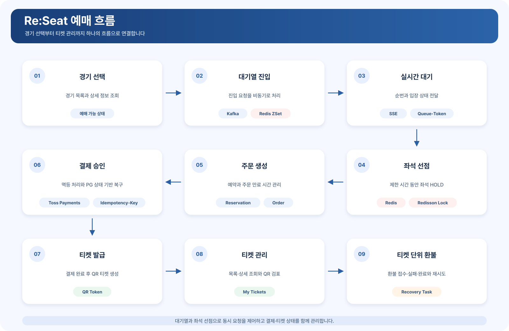
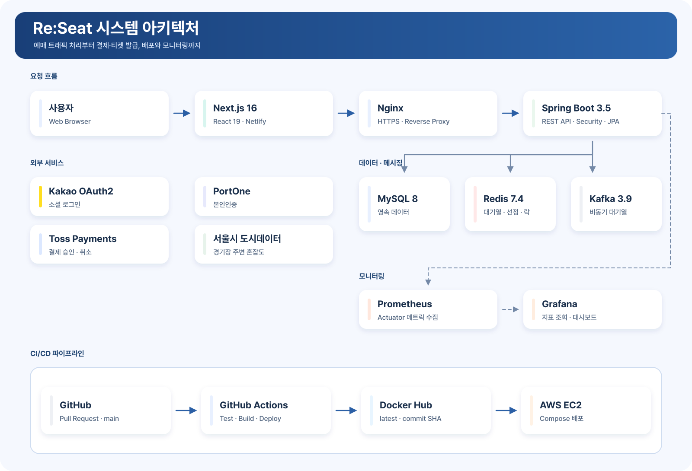
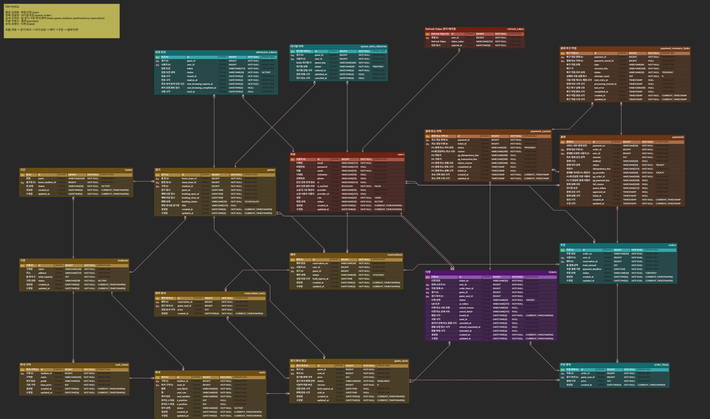

  <h1>⚾ Re:Seat</h1>
  
<strong>경기 선택부터 티켓 관리까지 하나의 흐름으로 연결한 KBO 경기 예매 서비스</strong>

  

    
    
  

  

    <a href="https://re-seat.netlify.app"><strong>서비스 바로가기</strong></a>
    ·
    <a href="./docs/presentation/reseat-3rd-presentation.pdf"><strong>발표 자료</strong></a>
    ·
    <a href="https://github.com/Back-To-Back-team-3/re-seat/tags"><strong>버전 태그</strong></a>
  

---

## 🧭 목차

- [🎟️ 프로젝트 소개](#project-overview)
- [👥 팀원 소개](#team)
- [✨ 주요 기능](#features)
- [🔄 예매 흐름](#booking-flow)
- [🏗️ 시스템 아키텍처](#system-architecture)
- [🗃️ ERD](#erd)
- [📖 API 명세서](#api-spec)
- [🧰 기술 스택](#tech-stack)
- [⚙️ 핵심 기술](#core-technology)
- [🗂️ 프로젝트 구조](#project-structure)
- [🛠️ 개발자 안내](#developer-guide)
- [🏷️ 버전 태그](#version-tags)
- [📚 관련 문서](#related-docs)

---

## 🎟️ 프로젝트 소개

Re:Seat는 인기 경기의 동시 예매 요청을 안정적으로 처리하고, 사용자가 경기 선택부터 티켓 관리까지 하나의 흐름으로 이용할 수 있도록 만든 야구 예매 서비스입니다.

Kafka와 Redis를 이용해 경기별 대기열을 운영하고, Redis 임시 선점과 Redisson 분산 락으로 좌석 선점 경쟁을 제어합니다. 주문과 Toss Payments 결제, QR 티켓 발급, 티켓 한 장 단위 환불까지 예매 이후의 상태도 함께 관리합니다.

서울시 실시간 도시데이터와 카카오맵을 연동해 경기장 위치와 주변 혼잡도도 제공합니다.

### 핵심 목표

| 목표 | Re:Seat의 해결 방식 |
| --- | --- |
| 동시 예매 요청 제어 | Kafka 비동기 처리와 Redis ZSet 기반 경기별 대기열로 요청을 순차 처리합니다. |
| 좌석 중복 선점 방지 | Redis 임시 선점과 Redisson 분산 락으로 동일 좌석에 대한 경쟁을 제어합니다. |
| 결제 이후 상태 정합성 | 멱등 처리, 주문 만료, PG 상태 기반 복구를 통해 주문·예약·좌석·티켓 상태를 함께 관리합니다. |
| 티켓 단위 환불 | 한 주문 안에서도 티켓 한 장 단위로 취소하고, 환불 진행·실패·완료 상태와 재시도를 관리합니다. |

---

## 👥 팀원 소개

<table width="1100">
  <thead><tr><th width="200">파트</th><th width="260">담당 도메인</th><th width="470">주요 역할</th><th width="170" align="center">담당자</th></tr></thead>
  <tbody>
    <tr>
      <td valign="top">사용자·인프라</td>
      <td valign="top"><code>user</code> <code>verification</code> <code>citydata</code> 배포&#8288;·&#8288;모니&#8288;터링</td>
      <td valign="top">인증·인가와 회원 관리 배포·운영 환경과 모니터링 도시데이터·지도 외부 API 연동</td>
      <td align="center" valign="top"><a href="https://github.com/LFCKJ"> <b>김재환</b> 팀원 @LFCKJ</a></td>
    </tr>
    <tr>
      <td valign="top">대기열·주문</td>
      <td valign="top"><code>queue</code> <code>order</code></td>
      <td valign="top">Kafka·Redis 대기열과 SSE 상태 전달 Queue-Token 발급·만료 주문 상태·결제 기한·자동 만료</td>
      <td align="center" valign="top"><a href="https://github.com/bepo03"> <b>전윤현</b> 팀장 @bepo03</a></td>
    </tr>
    <tr>
      <td valign="top">경기&#8288;·&#8288;좌석&#8288;·&#8288;예약</td>
      <td valign="top"><code>game</code> <code>stadium</code> <code>seatinventory</code> <code>reservation</code></td>
      <td valign="top">경기·구장·좌석 조회 좌석 HOLD·해제·만료와 동시성 제어 담당 도메인 관리자 API</td>
      <td align="center" valign="top"><a href="https://github.com/r1nn-dev"> <b>조하린</b> 팀원 @r1nn&#8288;-&#8288;dev</a></td>
    </tr>
    <tr>
      <td valign="top">결제</td>
      <td valign="top"><code>payment</code></td>
      <td valign="top">Toss Payments와 멱등 승인 부분·전체 환불과 취소 이력 PG 복구와 결제 이력</td>
      <td align="center" valign="top"><a href="https://github.com/Siho-ily"> <b>박현수</b> 팀원 @Siho&#8288;-&#8288;ily</a></td>
    </tr>
    <tr>
      <td valign="top">티켓</td>
      <td valign="top"><code>ticket</code></td>
      <td valign="top">티켓 발급·상태 관리와 QR 검표 마이페이지 통합 조회 티켓 단위 환불 상태와 관리자 강제 취소</td>
      <td align="center" valign="top"><a href="https://github.com/rmi9394"> <b>유명인</b> 팀원 @rmi9394</a></td>
    </tr>
  </tbody>
</table>

---

## ✨ 주요 기능

### 사용자 인증

- 카카오 OAuth2 소셜 로그인을 지원합니다.
- JWT를 이용해 사용자 인증과 API 접근 권한을 관리합니다.
- PortOne 본인인증을 통해 예매 사용자를 확인합니다.
- 일반 사용자와 관리자 권한을 구분합니다.

### 경기·구장 조회

- 예매 가능한 경기 목록과 경기 상세 정보, 날짜별 예매 가능 상태를 조회합니다.
- 카카오맵에서 구장 위치를 확인할 수 있습니다.
- 서울시 실시간 도시데이터를 이용해 경기장 주변 혼잡도를 제공합니다.

### 경기별 대기열

- Kafka를 이용해 대기열 진입 요청을 비동기로 처리합니다.
- Redis ZSet을 이용해 경기별 대기 순서를 관리합니다.
- SSE를 통해 대기 순서와 입장 상태를 실시간으로 전달합니다.
- 입장이 허용된 사용자에게 제한 시간이 있는 Queue-Token을 발급합니다.
- 처리에 실패한 Kafka 이벤트는 재시도 후 DLT로 전달합니다.

### 좌석 선택과 예매

- 경기별 좌석 등급, 가격과 예매 가능 상태를 조회합니다.
- Redis에 좌석을 임시 선점하고 Redisson 분산 락으로 동일 좌석의 동시 요청을 제어합니다.
- 좌석 선점 결과를 예약과 주문으로 연결합니다.
- 만료되거나 취소된 좌석을 다시 선점할 수 있도록 상태를 관리합니다.

### 주문과 결제

- 선점한 좌석을 기준으로 주문을 생성합니다.
- 주문별 결제 기한을 관리하고 만료된 주문을 자동으로 처리합니다.
- Toss Payments를 연동해 결제 승인과 취소를 처리합니다.
- `Idempotency-Key`를 이용해 같은 결제 요청이 반복되어도 중복 처리되지 않도록 관리합니다.
- PG 처리 결과를 확인할 수 없거나 로컬 상태 반영에 실패한 작업을 복구합니다.

### 티켓과 환불

- 결제가 완료된 주문에 대해 QR 토큰이 포함된 티켓을 발급합니다.
- 사용자가 보유한 티켓 목록과 상세 정보를 조회합니다.
- 주문에 포함된 티켓을 한 장 단위로 취소·환불할 수 있습니다.
- 환불 진행, 실패, 완료 상태를 구분하고 실패한 환불을 재시도할 수 있습니다.

---

## 🔄 예매 흐름

  

[흐름·상태 다이어그램 상세 보기](./docs/architecture/다이어그램%20v5.md)

---

## 🏗️ 시스템 아키텍처

  

[시스템 구성도 상세 보기](./docs/architecture/시스템%20구성도.md)

---

## 🗃️ ERD

[DB 구성 보기](./docs/erd/도메인%20및%20데이터베이스%20설계%20v5.0.md)

[ERDCloud에서 ERD 보기](https://www.erdcloud.com/d/vTFMNKfaHNn67E6XE)

---

## 📖 API 명세서

[API 명세서 보기](./docs/api/API%20명세서%20v5.0.md)

---

## 🧰 기술 스택

### Backend

     

### Frontend

     

### Database

 

### Cache·Lock

 

### Messaging

### 결제·인증 연동

  

### 외부 데이터 연동

 

### API 문서

### Monitoring

  

### Test

 

### Frontend Test

  

### Load Test

### Code Quality

 

### Infra·Deploy

     

---

## ⚙️ 핵심 기술

### Kafka와 Redis를 이용한 경기별 대기열

- 경기별 대기열 진입 요청을 Kafka로 비동기 처리합니다.
- Redis ZSet의 점수를 이용해 사용자의 대기 순서를 관리합니다.
- SSE로 대기 순서와 입장 상태를 전달하고, 입장이 허용된 사용자에게 Queue-Token을 발급합니다.
- Kafka 처리 실패는 재시도와 DLT로 분리해 관리합니다.

### 좌석 선점과 동시성 제어

- 좌석을 제한 시간 동안 Redis에 임시 선점합니다.
- Redisson 분산 락으로 동일 좌석에 대한 동시 요청을 제어합니다.
- 좌석 상태와 예약 상태를 함께 확인해 취소·만료된 좌석을 다시 선점할 수 있도록 관리합니다.
- 일반 테스트와 동시성 테스트를 분리해 CI에서 각각 검증합니다.

### 주문·결제·티켓 상태 정합성

- 결제 요청을 멱등하게 처리해 같은 요청이 반복되어도 중복 처리가 발생하지 않도록 관리합니다.
- 결제 결과에 따라 주문·예약·좌석·티켓 상태를 함께 변경합니다.
- PG 승인 후 로컬 반영에 실패한 결제와 처리 결과를 확인할 수 없는 환불은 복구 작업으로 관리합니다.
- 한 주문에서도 티켓 한 장 단위로 환불을 접수하고 실패한 작업을 재시도할 수 있습니다.

### 운영과 관측

- Spring Boot Actuator의 메트릭을 Prometheus가 수집하고 Grafana에서 확인합니다.
- GitHub Actions에서 코드 스타일, 단위·통합 테스트와 동시성 테스트를 검증합니다.
- `main` 반영 시 Docker 이미지를 `latest`와 commit SHA 태그로 게시하고 AWS EC2에 배포합니다.
- k6 스크립트로 대기열 진입과 결제 생성 흐름의 부하를 측정합니다.

[예매·대기열·결제 상태 정책 상세 보기](./docs/policy/정책%20및%20상태.md)

---

## 🗂️ 프로젝트 구조

~~~plain text
re-seat
├── src
│   ├── main
│   │   ├── java/com/backtoback/reseat
│   │   │   ├── domain
│   │   │   │   ├── admin                       # 도메인별 관리자 API
│   │   │   │   ├── citydata                    # 서울시 도시데이터 연동과 구장 혼잡도
│   │   │   │   ├── game                        # 경기 조회와 예매 상태
│   │   │   │   ├── order                       # 주문 생성·상태·만료
│   │   │   │   ├── payment                     # Toss 결제와 PG 상태 기반 복구
│   │   │   │   ├── queue                       # Kafka·Redis 대기열, SSE, Queue-Token
│   │   │   │   ├── reservation                 # 예약 생성·취소와 좌석 선점 연결
│   │   │   │   ├── seatinventory               # 경기 좌석 상태와 동시성 제어
│   │   │   │   ├── stadium                     # 구장 정보
│   │   │   │   ├── team                        # 야구팀 정보
│   │   │   │   ├── ticket                      # QR 티켓과 티켓 단위 환불
│   │   │   │   └── user                        # 인증·인가, 본인인증, 회원 관리
│   │   │   └── global                          # 공통 설정, 보안, 예외 처리
│   │   └── resources
│   │       └── db/migration                    # Flyway 마이그레이션
│   └── test                                    # 단위·통합·동시성 테스트
├── frontend-next
│   ├── app                                     # Next.js App Router 화면
│   ├── api                                     # 도메인별 API 클라이언트
│   ├── components                              # 공통·도메인 UI 컴포넌트
│   ├── hooks                                   # 공통 훅
│   ├── stores                                  # 클라이언트 상태 관리
│   └── test                                    # 프론트엔드 테스트 지원
├── docs                                       # 프로젝트 문서·설계 자료·발표 자료
├── scripts
│   ├── demo-data                               # 시연 데이터 준비
│   └── load-test                               # k6 부하 테스트와 준비 스크립트
├── .github/workflows                           # CI/CD와 GitHub 자동화
├── nginx                                       # HTTPS·SSE 리버스 프록시 설정
├── docker-compose.yml                          # 애플리케이션과 인프라 구성
├── prometheus.yml                              # 메트릭 수집 설정
├── Dockerfile
└── build.gradle
~~~

---

## 🛠️ 개발자 안내

<strong>로컬 실행 및 검증</strong>

### 로컬 실행

#### 요구 사항

- Java 17
- Node.js와 npm
- Docker와 Docker Compose

#### 환경변수 설정

저장소 루트의 환경변수 예시 파일을 복사합니다.

~~~bash
cp .env.example .env
~~~

`.env`의 예시 값을 로컬 환경에 맞게 변경하고 필요한 환경변수를 설정합니다. 실제 비밀번호와 API 키가 포함된 파일은 Git에 커밋하지 않습니다.
프론트엔드는 별도의 환경변수 파일을 사용합니다.

~~~bash
cd frontend-next
cp .env.example .env.local
~~~

#### 백엔드와 인프라 실행

~~~bash
./gradlew clean bootJar
docker compose up -d
~~~

<table fit-page-width="true" header-row="true">
<tr>
<td>구성 요소</td>
<td>주소</td>
</tr>
<tr>
<td>Backend API</td>
<td>`http://localhost:8080`</td>
</tr>
<tr>
<td>Swagger UI</td>
<td>`http://localhost:8080/swagger-ui/index.html`</td>
</tr>
<tr>
<td>Prometheus</td>
<td>`http://localhost:9090`</td>
</tr>
<tr>
<td>Grafana</td>
<td>`http://localhost:3000`</td>
</tr>
</table>
실행 중인 컨테이너를 종료합니다.

~~~bash
docker compose down
~~~

#### 프론트엔드 실행

~~~bash
cd frontend-next
npm install
npm run dev
~~~

- Frontend: `http://localhost:5173`
- Backend: `http://localhost:8080`

### 검증

#### 백엔드

~~~bash
./gradlew clean spotlessCheck test
./gradlew concurrencyTest
~~~

- `test`: 단위·통합 테스트를 실행합니다.
- `concurrencyTest`: MySQL과 Redis를 이용하는 동시성 테스트를 별도로 실행합니다.

#### 프론트엔드

~~~bash
cd frontend-next
npm run lint
npm run test
npm run build
~~~

---

## 🏷️ 버전 태그

- [v0.5.0](https://github.com/Back-To-Back-team-3/re-seat/tree/v0.5.0)
- [v0.4.0](https://github.com/Back-To-Back-team-3/re-seat/tree/v0.4.0)
- [v0.3.0](https://github.com/Back-To-Back-team-3/re-seat/tree/v0.3.0)
- [v0.2.0](https://github.com/Back-To-Back-team-3/re-seat/tree/v0.2.0)
- [v0.1.0](https://github.com/Back-To-Back-team-3/re-seat/tree/v0.1.0)

---

## 📚 관련 문서

- [3차 프로젝트 발표 자료 보기](./docs/presentation/reseat-3rd-presentation.pdf)
- [3차 프로젝트 발표 자료 원본](./docs/presentation/reseat-3rd-presentation.pptx)
- [기획서 v5.0](./docs/planning/기획서%20v5.0.md)
- [스케줄러](./docs/architecture/스케줄러.md)
- [Git/GitHub 메뉴얼](./docs/guides/Git%20GitHub%20메뉴얼.md)
- [Next.js 프론트엔드 실행 안내](https://github.com/Back-To-Back-team-3/re-seat/blob/main/frontend-next/README.md)
- [GitHub Actions CI](https://github.com/Back-To-Back-team-3/re-seat/blob/main/.github/workflows/ci.yml)
- [GitHub Actions CD](https://github.com/Back-To-Back-team-3/re-seat/blob/main/.github/workflows/cd.yml)
- [Docker Compose 구성](https://github.com/Back-To-Back-team-3/re-seat/blob/main/docker-compose.yml)
