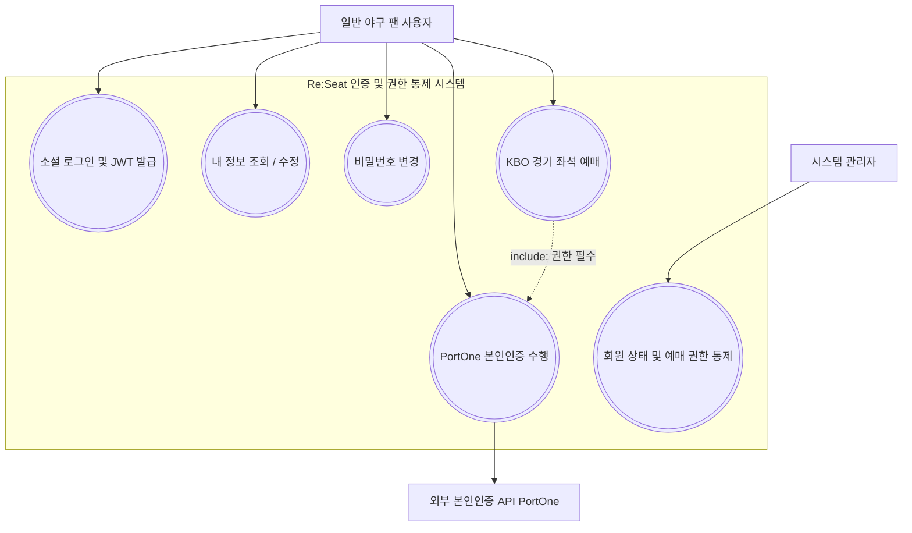
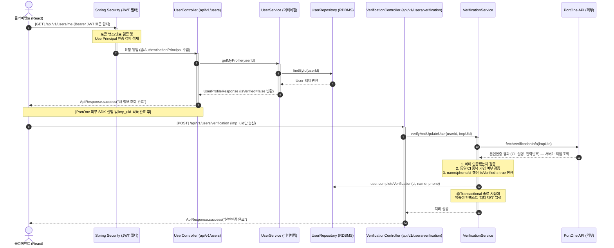
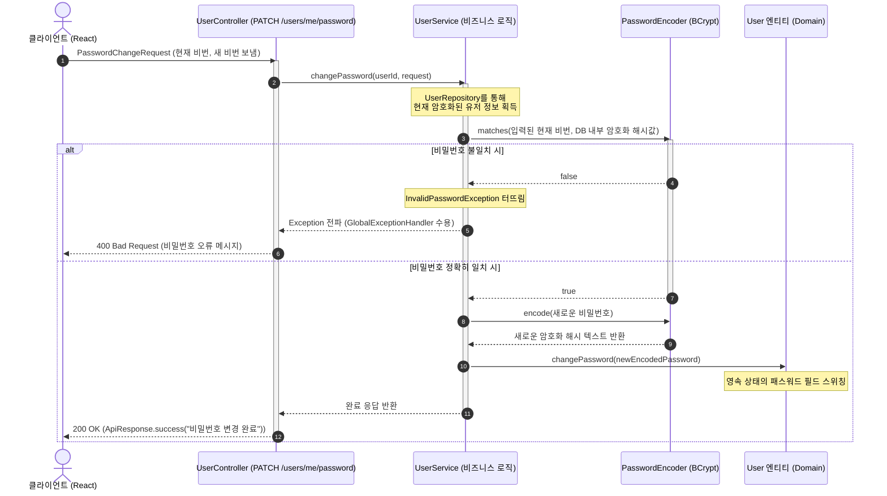
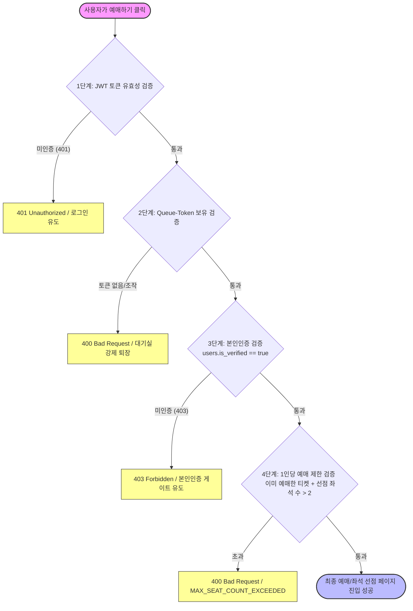
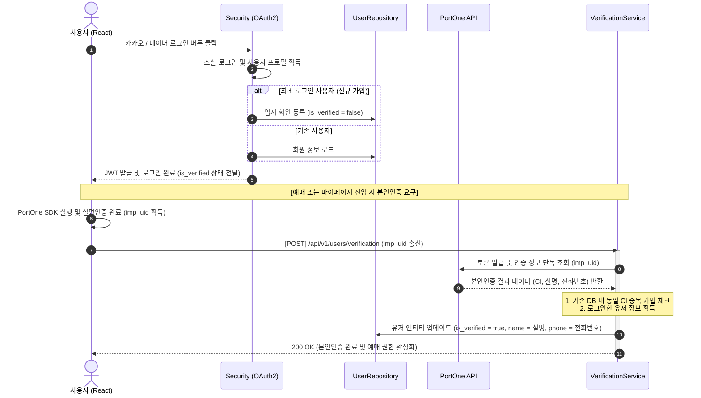
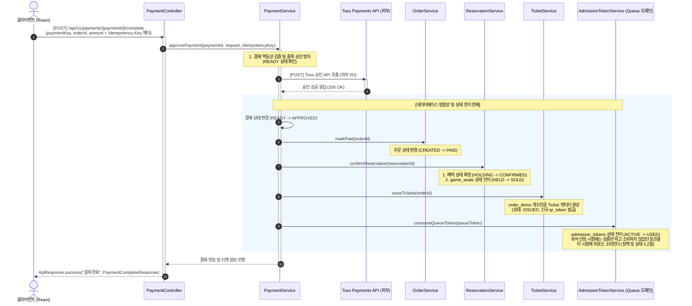
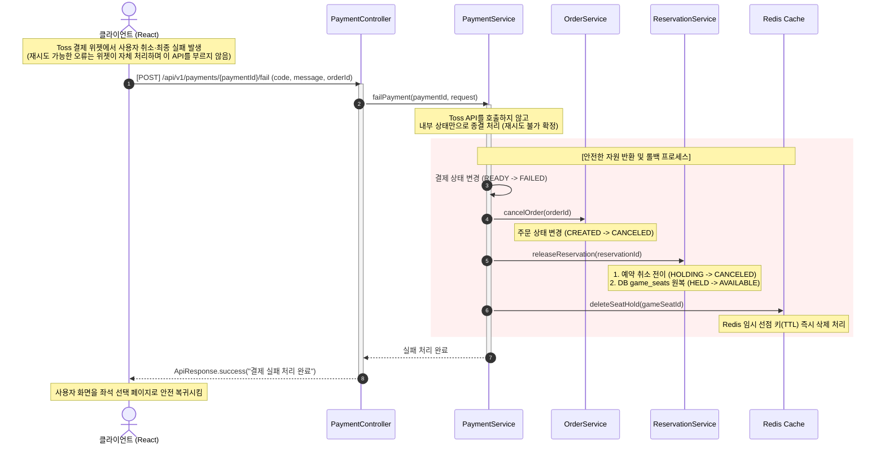
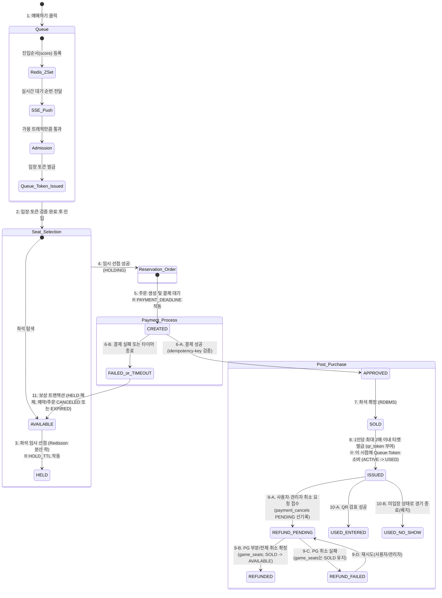
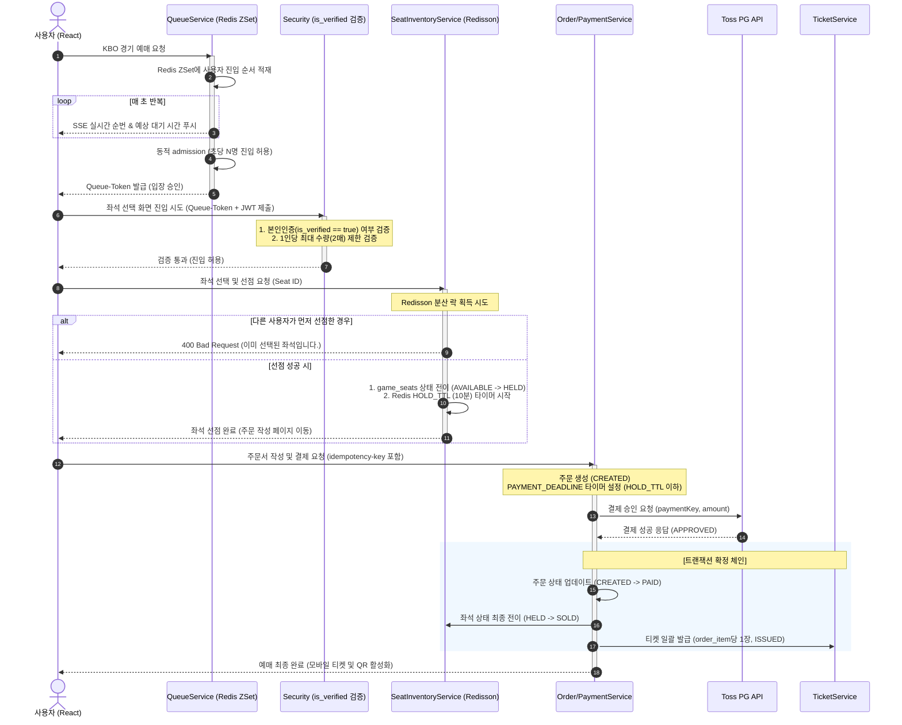
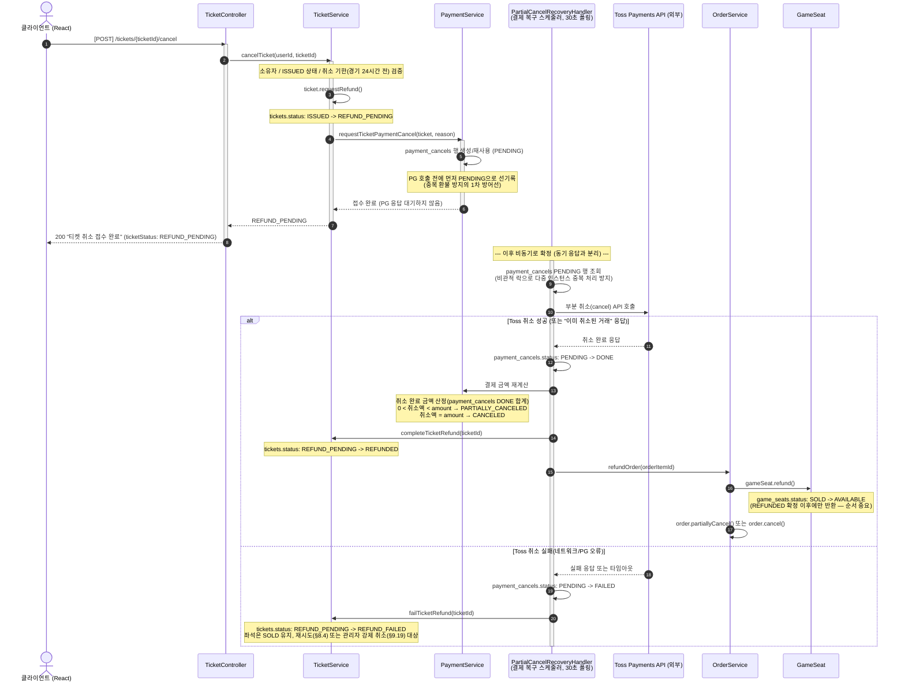

# 다이어그램 v5

> 수정일: 2026.09.15
> 

### 인증 및 예매 권한 통제

### 본인인증 및 예매 권한 획득 흐름

- `GET /api/v1/users/me` (실제 컨트롤러 `UserController`)
- `POST /api/v1/users/verification` (실제 `VerificationController`)
- 실제 흐름
    - 클라이언트가 `impUid`만 보내고, 서버가 PortOne에서 CI·실명·전화번호를 직접 조회한다.

### 비밀번호 변경 및 해시 검증 흐름

### 본인인증 예매 가드 레이어

- JWT → Queue-Token → 본인인증 → 수량 검증 순서와 에러코드(`MAX_SEAT_COUNT_EXCEEDED`)

### 소셜 로그인 + 본인인증 통합 데이터 흐름

- 클라이언트가 부르는 본인인증 API 경로: `POST /api/v1/users/verification`

### 결제 승인 성공 및 티켓 발급 시퀀스

- 경로: `POST /api/v1/payments/{paymentId}/complete`

### 결제 실패 및 좌석 즉시 복구 시퀀스

- 결제 실패 처리시에는 토스 결제 API를 호출하지 않으며(결제 실패 API가 존재하지 않음), 내부적으로만 처리된다.
- 위젯 오류·재시도 가능한 실패는 클라이언트(Toss 위젯)가 자체적으로 처리하고, 서버의 `fail` API는 재시도 불가능한 종결 상황에서만, Toss를 호출하지 않고 내부 상태만 바꾼다.

### 도메인 전체 아키텍처 및 상태 흐름도

- 티켓은 `ISSUED` 이후 `REFUND_PENDING`/`REFUND_FAILED`/`REFUNDED`/`USED_ENTERED`/`USED_NO_SHOW`로 세분화된다. 이 세분화는 "예정"이 아니라 3차에서 이미 적용 완료됐다(T3-06, ERD 3.16).

### 일반 사용자 상세 시퀀스

- 대기열 → 가드 → 선점 → 주문/결제
- `HOLD_TTL 10분`

### 티켓 부분 환불(취소) 시퀀스

- 경로: `POST /api/v1/tickets/{ticketId}/cancel` (§8.3), 재시도 `POST /api/v1/tickets/{ticketId}/cancel/retry` (§8.4)
- 접수(동기)와 확정(비동기)이 분리되어 있다. 클라이언트는 접수 응답만 받고, 최종 결과는 티켓/결제 조회로 재확인한다.
- 취소 이력을 PG 호출 **전에** `PENDING`으로 먼저 남기는 이유: PG 취소가 성공한 직후 서버가 죽으면 자금은 나갔는데 내부 상태는 그대로 남는 문제를 막기 위해서다(ERD 6.4 설계 판단).

- 재시도(§8.4)는 새 `payment_cancels` 행을 만들지 않고 기존 `FAILED` 행을 `PENDING`으로 되돌려 위 시퀀스를 그대로 반복한다(`uk_payment_cancels_ticket`이 티켓당 이력 1건을 스키마 레벨에서 강제).
- 관리자 강제 취소(§9.19 경기별 일괄 취소 포함)도 진입점만 `AdminTicketController`로 다를 뿐, `TicketService.cancelTicketByAdmin()` 이후는 위와 동일한 파이프라인을 그대로 탄다.
